# Widget Shop — Design & Requirements

## 1. Overview

Widget Shop is a small e-commerce application. It lets customers register, browse a catalog of widgets, add items to a cart, and check out with a credit card processed by a **third-party external payment processor** (e.g. a Stripe-style gateway). Backend admins manage the catalog and pricing; a customer service role handles refunds and exchanges.

The app is a **Single Page Application (SPA)** frontend backed by a **REST API**, with a **SQL database** for persistence, and is deployed as a set of **Docker containers**.

---

## 2. Goals / Non-Goals

**Goals**

- Small-scope e-commerce app: auth, catalog, cart, checkout, order history, refunds/exchanges.
- Clear separation of roles: Customer, Admin, Customer Service.
- Simple enough to reason about end-to-end (schema, API, UI).
- Integration with a real external payment processor's API surface (tokenization, charge, refund).

**Non-Goals**

- No PCI compliance program to build/audit ourselves — card data is tokenized directly with the processor, minimizing our PCI scope.
- No multi-tenancy, internationalization, tax calculation, or shipping-carrier integration.
- No high-availability / multi-region scaling in this phase — a single-region deployment is sufficient for current business volume.

---

## 3. Tech Stack

| Layer      | Choice                                                                                                                                                                               |
| ---------- | ------------------------------------------------------------------------------------------------------------------------------------------------------------------------------------ |
| Frontend   | SPA (React or similar), calling the backend via JSON REST API                                                                                                                        |
| Backend    | Node.js API server (e.g. Express)                                                                                                                                                    |
| Database   | SQL (PostgreSQL or SQLite for local/dev) via an ORM/query builder                                                                                                                    |
| Auth       | Short-lived JWT access tokens (held in-memory client-side) + rotating opaque refresh tokens in an `HttpOnly`/`Secure`/`SameSite` cookie (see §3.2); password hashing (bcrypt/argon2) |
| Email      | Transactional email provider (SMTP relay or API), used to deliver password-reset links                                                                                               |
| Payments   | Real external payment processor (e.g. Stripe-style gateway), accessed over HTTPS via a thin client module                                                                            |
| Deployment | Docker containers, orchestrated via Docker Compose                                                                                                                                   |

---

## 3.1 Architecture Diagram

The following diagram reflects the containers described in §3 and §11: a browser-hosted SPA, an API server backed by a SQL database, and a **real, third-party payment processor** that lives outside our infrastructure. The SPA talks to the processor directly for tokenization, and the API talks to it server-to-server for charges/refunds.

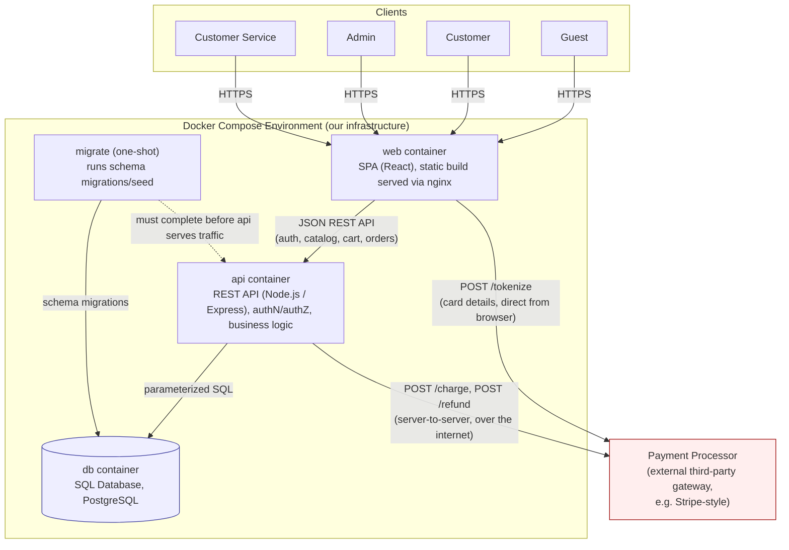

Key architectural points from this document:

- The SPA never routes raw card data through the API (§6) — it goes browser → payment processor directly, returning only an opaque `card_token`.
- The payment processor is an **external system outside our trust boundary**, reached over the public internet — not a container we operate (§11.1).
- The API is the sole client of the database and is the actual authorization boundary (§4) even though the SPA also hides unauthorized UI.
- `db` is not published to the host; only `api` can reach it (§11.2).
- `migrate` must complete before `api` accepts traffic (§11.4, §11.7.5).

---

## 3.2 Session & Token Security

Storing a JWT somewhere the client-side JavaScript can read it (`localStorage`, `sessionStorage`, or a non-`HttpOnly` cookie) means any successful XSS on the SPA can exfiltrate it — the token then works from anywhere, for as long as it's valid, with no way for the server to tell the difference from the real user. To close that off, the app splits authentication into two tokens with different exposure and lifetimes:

- **Access token**: a short-lived (e.g. 15 minute) JWT returned in the login/refresh response _body_. The SPA keeps it only in memory (a JS variable, scoped to the running tab) — never written to `localStorage`, `sessionStorage`, or any other persistent client-side store. It doesn't survive a page reload and isn't a standing target for exfiltration; even if it's read via XSS, its blast radius is capped at ~15 minutes.
- **Refresh token**: an opaque, random, single-use token delivered _exclusively_ via an `HttpOnly`, `Secure`, `SameSite=Strict` cookie. Because it's `HttpOnly`, injected JavaScript can never read it — the primary XSS token-theft vector doesn't apply to it. The server stores only a hash of it (`refresh_tokens`, see §5), never the plaintext.
- **Refresh & rotation**: `POST /api/auth/refresh` authenticates purely off the cookie (no token in the request body) and returns a new access token. Every refresh **rotates** the refresh token: the presented one is marked used and a new one is issued. If an already-used refresh token is ever presented again, that's a signal it was stolen and replayed — the server revokes the entire token family and forces re-login.
- **CSRF on the refresh endpoint**: since it's cookie-authenticated, `POST /api/auth/refresh` (and any other cookie-authenticated endpoint) additionally requires a custom header (e.g. `X-Requested-With`) that a cross-site form or ``/`<form>` CSRF attempt cannot attach — defense in depth alongside `SameSite=Strict`.
- **Revocation**: wherever this document says a flow "invalidates the user's other active sessions" (§7.1a Forgot/Reset Password, §7.1b Change Password), that means revoking the corresponding rows in `refresh_tokens`. A stateless JWT access token can't be revoked before it expires on its own, so every session-termination guarantee in this document is backed by the refresh-token table, not the access token.
- **Defense in depth**: a strict Content-Security-Policy (no `unsafe-inline`, no `unsafe-eval`) is applied SPA-wide to reduce the underlying XSS risk in the first place — the token-handling design above is what limits the damage _if_ that's ever bypassed, not a substitute for it.

---

## 4. Roles & Permissions

| Role                      | Capabilities                                                                                                                                                                                    |
| ------------------------- | ----------------------------------------------------------------------------------------------------------------------------------------------------------------------------------------------- |
| **Guest**                 | Browse catalog, view widget details, register, log in                                                                                                                                           |
| **Customer**              | Everything Guest can do, plus: manage own profile/addresses, manage cart, checkout, view own order history, request a return/exchange                                                           |
| **Admin**                 | Manage catalog (create/edit/delete widgets, set prices, manage inventory/stock), manage widget categories, view all orders (read-only), manage user role assignments                            |
| **Customer Service (CS)** | View all orders and customers, issue refunds (full/partial) against an order/payment, process exchanges (accept returned item, ship replacement / adjust order), add internal notes to an order |

Role checks are enforced **server-side** on every API endpoint — the SPA hides UI it shouldn't show, but the API is the actual authorization boundary.

Admin and CS accounts are internal/staff accounts, not self-service registrations — they're provisioned by an existing Admin.

---

## 5. Core Domain / Data Model

The full set of tables, columns, types, and foreign keys is captured in the ER diagrams below (§5.1–§5.3). A few business rules aren't visible from column names alone and are called out here:

- **`users.role`** defaults to `customer`; `admin` and `customer_service` are staff-provisioned (§4).
- **`widgets.is_active`** is a soft "delisting" flag — widgets are never hard-deleted.
- **Carts**: one active cart per user (or session for guests, if guest carts are supported — otherwise require login before cart use).
- **`cart_items.unit_price_cents`**: recommend **re-pricing at checkout** from `widgets.price_cents` rather than trusting a price snapshotted at add-time, to avoid stale-price abuse.
- **`order_items.unit_price_cents`** is immutable once set — it is the price at time of purchase and is never affected by later catalog price changes.
- **`password_reset_tokens`** are single-use and time-limited: a token is stored hashed (never plaintext), carries an `expires_at`, and is marked used (or deleted) the moment it's redeemed or superseded by a newer request.
- **`users.failed_login_attempts` / `locked_until`** implement account lockout: consecutive failed logins increment the counter; reaching a configured threshold sets `locked_until` (a cooldown period) and further login attempts are rejected until it elapses. A successful login resets the counter.
- **`refresh_tokens`** back the session/token-theft mitigations in §3.2: each row is a single-use, rotating refresh token stored hashed (never plaintext), with `expires_at` and `revoked_at`. Revoking a user's sessions (e.g. on password change) means setting `revoked_at` on their active rows here — the short-lived JWT access token itself is never persisted or revocable.
- **No table ever stores a full card number, CVV, or expiration date.** Only the processor's opaque token (`payments.processor_card_token`) and display metadata (`card_last4`, `card_brand`) are persisted, consistent with basic PCI-DSS scope reduction.

The data model is presented as three diagrams grouped by domain — Users & Catalog, Orders & Fulfillment, and Auth & Session Security — so each stays focused and easy to read rather than one large, hard-to-follow schema. An entity referenced without its column list in a diagram below is shown there only to anchor a cross-diagram relationship; its full definition lives in the diagram where it's the primary subject.

### 5.1 Proposed ER Diagram — Users & Catalog

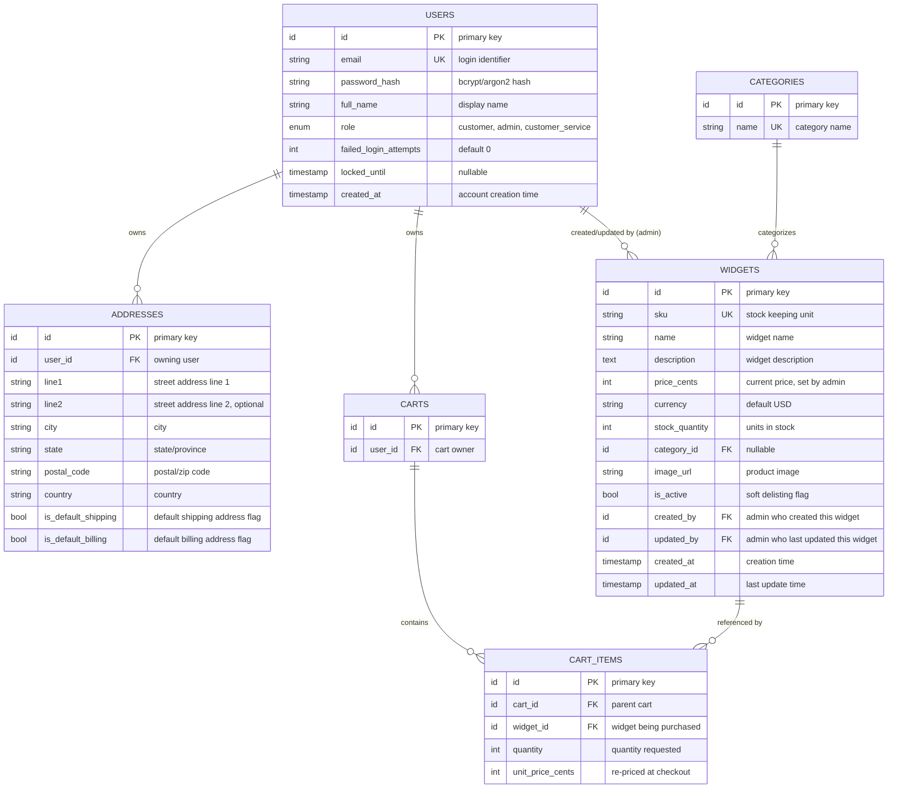

### 5.2 Proposed ER Diagram — Orders & Fulfillment

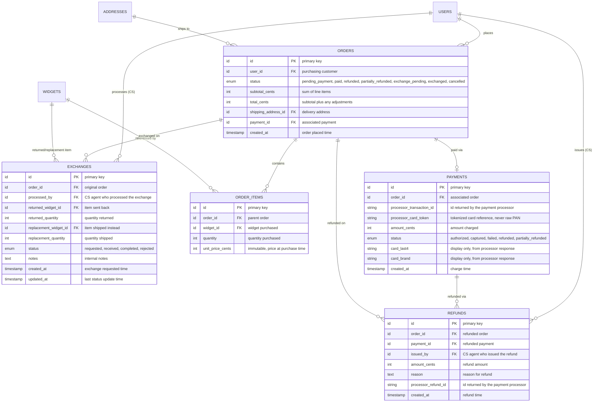

### 5.3 Proposed ER Diagram — Auth & Session Security

The `password_reset_tokens` and `refresh_tokens` tables that back §3.2 and §7.1a/§7.1b are split out here rather than folded into §5.1/§5.2, both to keep those diagrams smaller and because they're conceptually about session/credential security rather than the commerce domain.

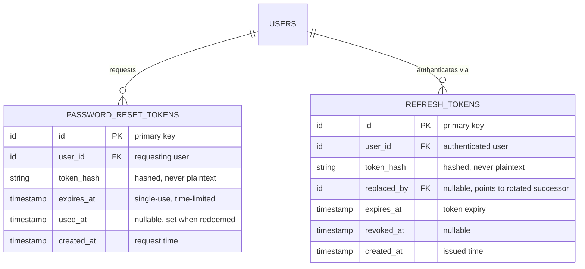

Together, these three diagrams are a direct rendering of the tables and foreign keys defined above (§5); they do not introduce any structure not already specified there.

---

## 6. Payment Processor Integration

The application integrates with a **real, external, third-party payment processor** (e.g. a Stripe-style gateway) over HTTPS, accessed from the backend through an internal client module (`services/paymentClient.js` or similar). The integration surface:

- `POST /tokenize` — accepts card details **directly from the client-side SPA to the processor**, never through our backend, returning a `card_token`. (This mirrors real-world practice: our server never sees/touches raw PAN, minimizing our PCI scope.)
- `POST /charge` — backend calls with `{ card_token, amount_cents, currency, order_id }`, returns `{ transaction_id, status, last4, brand }`.
- `POST /refund` — backend calls with `{ transaction_id, amount_cents }`, returns `{ refund_id, status }`.

This integration surface is intentionally modeled on how real gateways work (client-side tokenization, server-side charge/refund) rather than being a bespoke protocol, so the app's behavior generalizes to whichever real processor a deployment chooses. See §10 for how this integration is tested without moving real money.

---

## 7. Key Flows

### 7.1 Registration / Login

1. Guest submits email/password (+ name) → server hashes password, creates `users` row with role `customer`.
2. Login validates credentials, then issues a short-lived JWT access token (returned in the response body) and a rotating refresh token (set as an `HttpOnly`/`Secure`/`SameSite` cookie) — see §3.2 for why the two tokens are handled differently. See §7.1c for the account-lockout behavior applied on repeated failures.

### 7.1a Forgot / Reset Password

1. Guest submits their email on a "forgot password" form.
2. Server looks up the user; regardless of whether a match is found, it returns the same generic response (to avoid leaking which emails are registered).
3. If a match is found, server generates a single-use, time-limited reset token, stores only its hash in `password_reset_tokens` (with `expires_at`), and emails a reset link containing the plaintext token to the user's registered email address via the transactional email provider.
4. User follows the link, submits a new password (+ the token from the link).
5. Server validates the token (exists, unexpired, unused), hashes the new password, updates `users.password_hash`, marks the token used, and revokes all of the user's `refresh_tokens` (§3.2) so any existing sessions — including one an attacker may have obtained — are logged out.

### 7.1b Change Password

1. Authenticated customer submits their current password and a new password from their account settings.
2. Server re-verifies the current password against `users.password_hash` before allowing the change (prevents a hijacked session with a stolen token/cookie, but no credentials, from silently taking over the account).
3. On success: server hashes and stores the new password, and revokes all of the user's `refresh_tokens` (§3.2) other than the one backing the current session.
4. On failure (current password incorrect): request rejected, password unchanged.

### 7.1c Account Lockout / Login

1. Login request arrives with email + password.
2. Server looks up the user and first checks `locked_until`: if it's set and still in the future, the request is rejected immediately (generic "account temporarily locked, try again later" response) — the password is not checked.
3. Otherwise, server verifies the password:
   - **Incorrect**: increment `failed_login_attempts`. If the new count reaches the configured threshold (e.g. 5), set `locked_until` to now + a cooldown window (e.g. 15 minutes). Respond with a generic "invalid email or password" error either way (the account-locked message is only shown once the threshold is actually hit, on that same response).
   - **Correct**: reset `failed_login_attempts` to 0, clear `locked_until`, issue an access token + refresh-token cookie as in §7.1/§3.2.

### 7.2 Browse Catalog

- Public endpoint lists active widgets, filterable by category, searchable by name; widget detail view shows description/price/stock.

### 7.3 Cart & Checkout

1. Authenticated customer adds/updates/removes items in their cart.
2. On checkout: customer supplies shipping address and card details (entered directly into a payment-processor-hosted field/component in the SPA → tokenized client-side).
3. SPA sends `card_token` + cart + shipping address to backend `POST /api/orders`.
4. Backend re-prices cart from current `widgets.price_cents`, creates `orders` (status `pending_payment`) + `order_items`, calls the payment processor `/charge`.
5. On success: create `payments` row, set order status `paid`, decrement `stock_quantity`, clear cart.
6. On failure: order marked failed/cancelled, customer notified, cart preserved.

### 7.4 Admin — Catalog Management

- Admin creates/edits widgets (name, description, price, stock, category, image, active flag).
- Price changes only affect future carts/orders (existing `order_items.unit_price_cents` are immutable history).

### 7.5 Customer Service — Refunds

1. CS looks up an order (by order id, customer email, etc.).
2. CS issues a full or partial refund with a reason.
3. Backend calls the payment processor `/refund` for `amount_cents` against the original `processor_transaction_id`.
4. On success: create `refunds` row, update `payments.status` and `orders.status` (`refunded`/`partially_refunded`).

### 7.6 Customer Service — Exchanges

1. Customer (or CS on their behalf) requests an exchange on a delivered order, specifying returned item(s) and desired replacement.
2. CS marks the return `received` once the item is physically back.
3. CS completes the exchange: system creates/updates the replacement shipment; if replacement price differs from returned item, CS issues a partial refund or requests an additional payment (via a new charge through the payment processor) to settle the difference.
4. Order/exchange status updated to `completed`.

---

## 7.7 Sequence Diagrams

### 7.7.1 Registration / Login (§7.1)

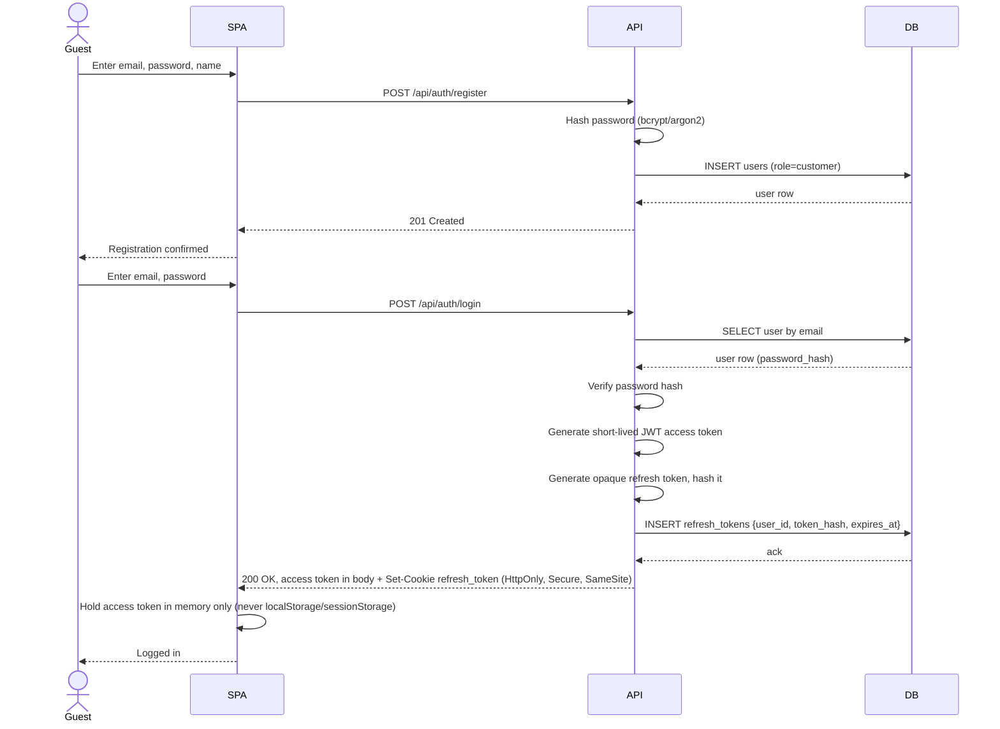

_(See §3.2 for why the access token stays in memory while the refresh token lives only in an `HttpOnly` cookie.)_

### 7.7.2 Browse Catalog (§7.2)

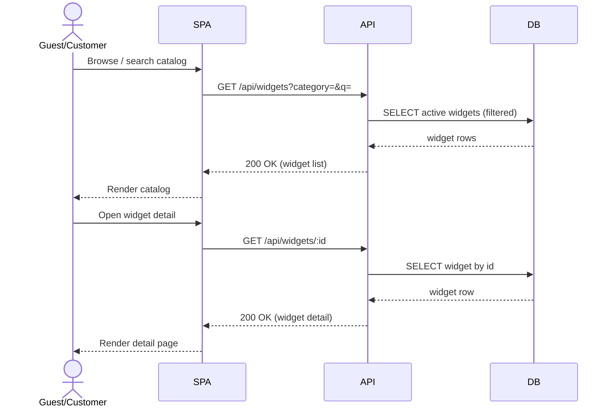

### 7.7.3 Cart & Checkout (§7.3)

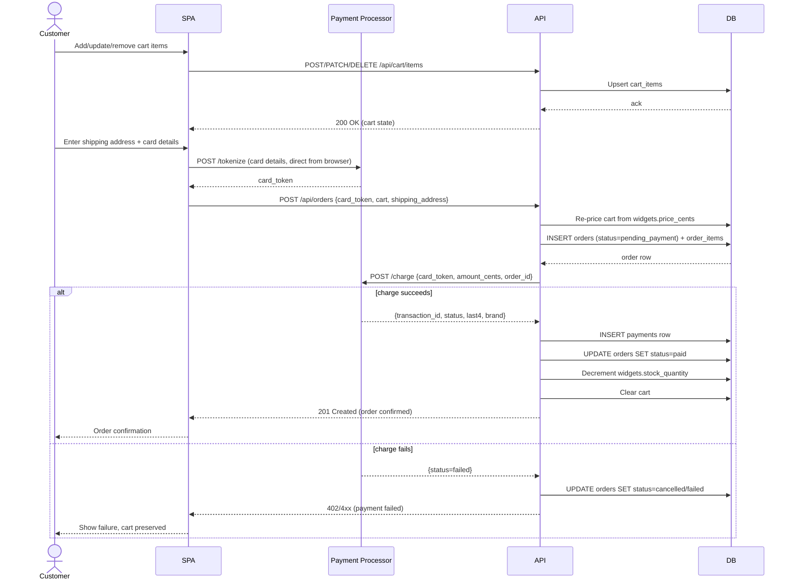

### 7.7.4 Admin — Catalog Management (§7.4)

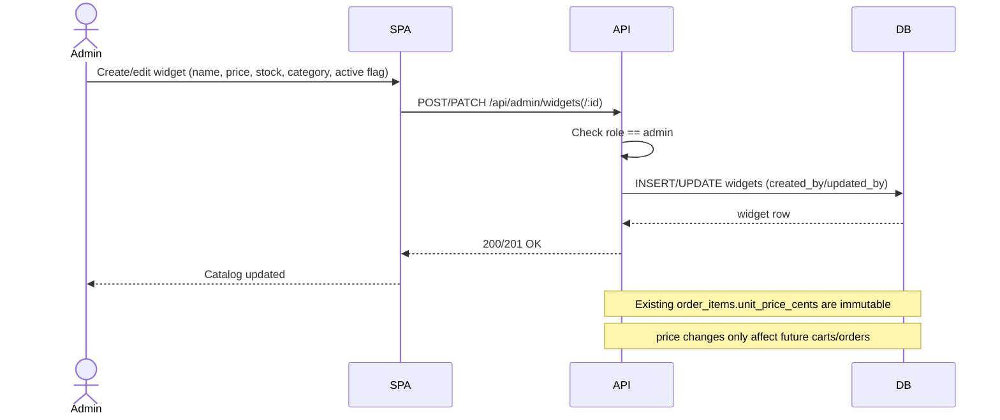

### 7.7.5 Customer Service — Refunds (§7.5)

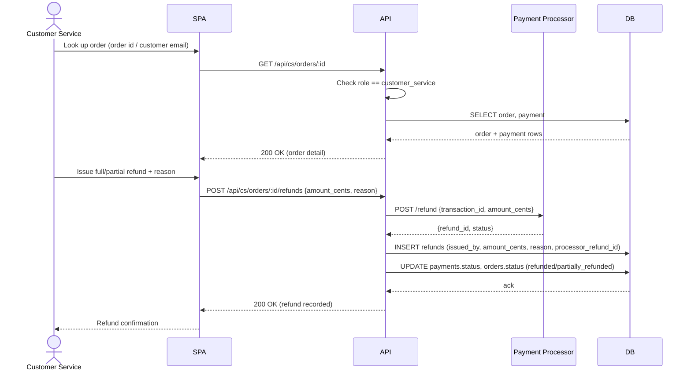

### 7.7.6 Customer Service — Exchanges (§7.6)

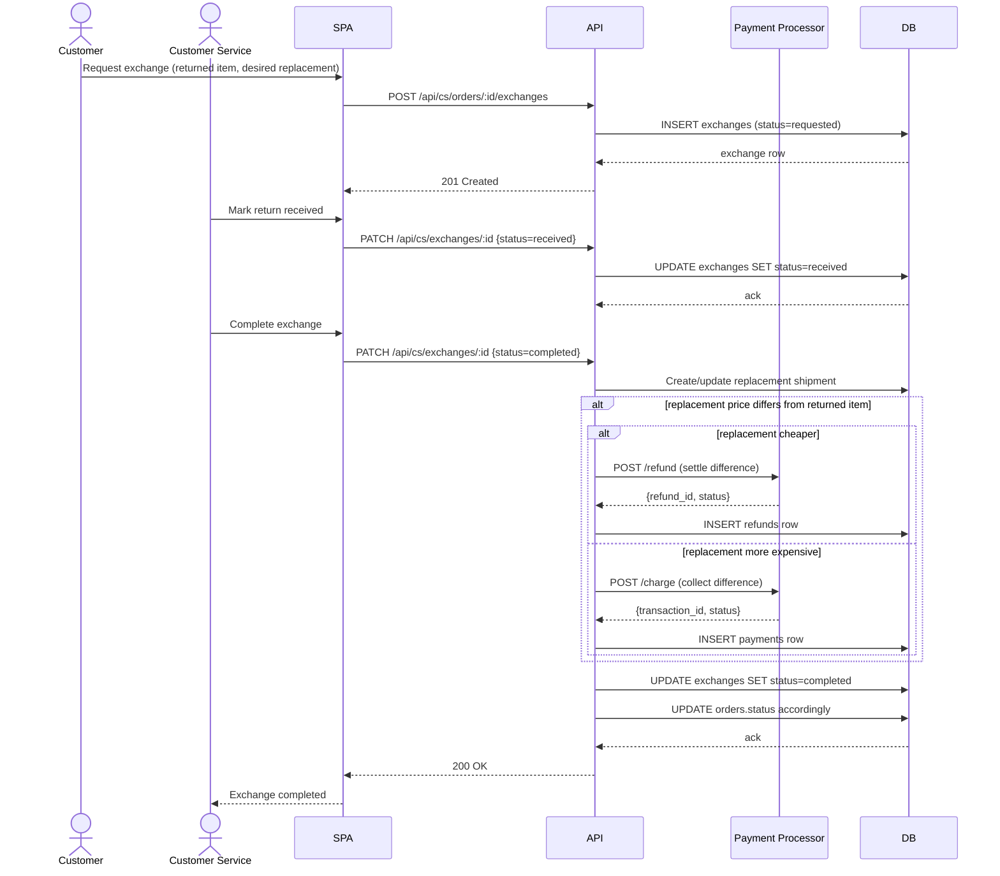

### 7.7.7 Forgot / Reset Password (§7.1a)

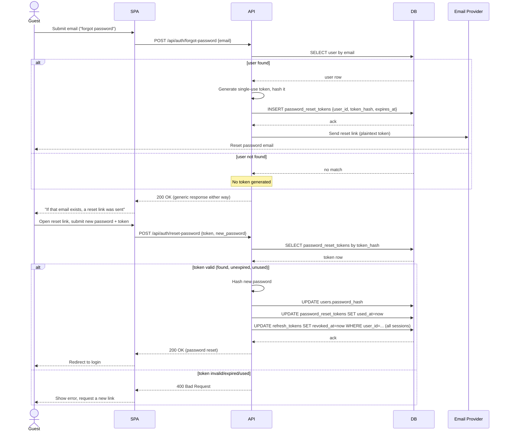

### 7.7.8 Change Password (§7.1b)

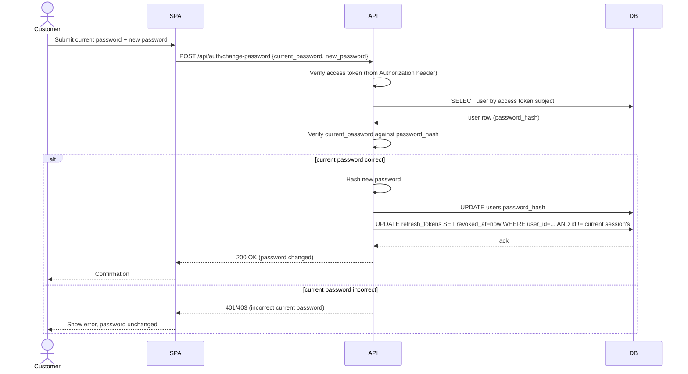

### 7.7.9 Account Lockout / Login (§7.1c)

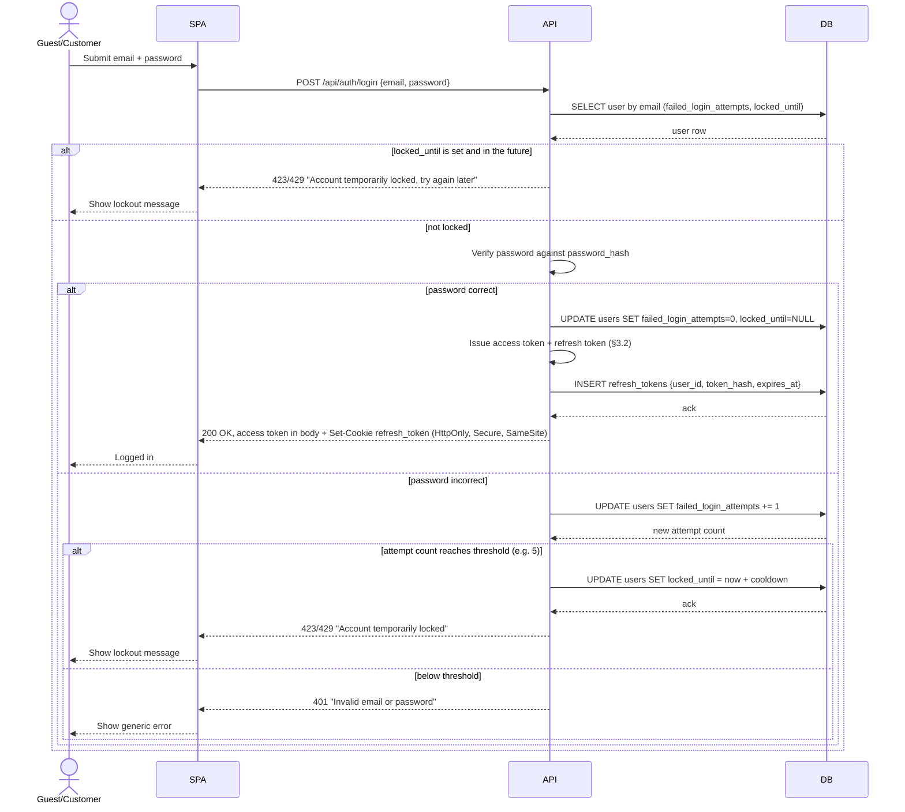

### 7.7.10 Token Refresh & Stolen-Token Detection (§3.2)

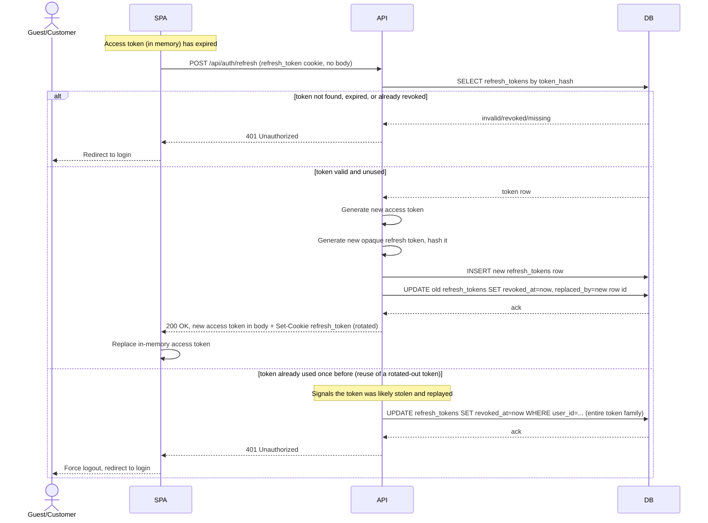

---

## 8. API Surface (representative, not exhaustive)

```
Auth
  POST   /api/auth/register
  POST   /api/auth/login
  POST   /api/auth/forgot-password   (request reset link, always generic response)
  POST   /api/auth/reset-password    (consume token, set new password)
  POST   /api/auth/change-password   (authenticated, requires current password)
  POST   /api/auth/refresh           (cookie-authenticated, rotates refresh token, returns new access token)
  POST   /api/auth/logout            (revokes the current refresh token)

Catalog (public)
  GET    /api/widgets
  GET    /api/widgets/:id
  GET    /api/categories

Cart (customer)
  GET    /api/cart
  POST   /api/cart/items
  PATCH  /api/cart/items/:itemId
  DELETE /api/cart/items/:itemId

Checkout / Orders (customer)
  POST   /api/orders                 (checkout)
  GET    /api/orders                 (own order history)
  GET    /api/orders/:id

Admin (admin only)
  POST   /api/admin/widgets
  PATCH  /api/admin/widgets/:id
  DELETE /api/admin/widgets/:id
  POST   /api/admin/categories
  GET    /api/admin/orders           (read-only, all orders)
  PATCH  /api/admin/users/:id/role

Customer Service (customer_service only)
  GET    /api/cs/orders
  GET    /api/cs/orders/:id
  POST   /api/cs/orders/:id/refunds
  POST   /api/cs/orders/:id/exchanges
  PATCH  /api/cs/exchanges/:id
```

All non-public endpoints require authentication; role-restricted endpoints additionally check `role` server-side.

---

## 9. Functional Requirements Summary

1. Users can register and log in with email + password.
2. Any user (including guests) can browse and search the widget catalog.
3. Authenticated customers can add/update/remove items in a cart and check out.
4. Checkout requires a shipping address and a credit card, processed via the external payment processor; the app never stores raw card numbers.
5. Successful checkout creates an order and decrements stock; failed checkout leaves the cart intact.
6. Admins can create, edit, and deactivate widgets, including setting price and stock.
7. Admins can view all orders (read-only) and manage staff role assignments.
8. Customer Service agents can view any order, issue full/partial refunds with a reason, and process exchanges (return + replacement, with price-difference settlement).
9. Every refund/exchange records who performed it and when (audit trail).
10. Role-based access control is enforced on the backend for every state-changing operation.
11. Users can request a password reset email and set a new password via a single-use, time-limited link, without revealing whether a given email is registered.
12. Authenticated users can change their password by re-confirming their current password.
13. An account is temporarily locked out after a configured number of consecutive failed login attempts, and automatically unlocks after a cooldown period.
14. A logged-in session survives beyond the short access-token lifetime via silent refresh, without ever exposing a long-lived credential to client-side JavaScript.

## 10. Non-Functional Requirements

- **Security**: password hashing, parameterized SQL (no string-concatenated queries), server-side authZ on every endpoint, no raw card data at rest, HTTPS assumed in deployment. Password reset tokens are single-use, time-limited, stored hashed, and the forgot-password endpoint is rate-limited and returns a uniform response to avoid user enumeration. Login enforces account lockout after repeated failed attempts to slow down credential-stuffing/brute-force attacks. **Token theft**: the JWT access token is never persisted client-side (in-memory only, ~15 min lifetime); the refresh token that keeps the session alive is only ever exposed via an `HttpOnly`/`Secure`/`SameSite` cookie, is single-use with rotation, and reuse of an already-rotated refresh token revokes the whole session family as a theft signal (§3.2). A CSP restricting inline scripts limits the underlying XSS surface that this design assumes could otherwise be exploited.
- **Data integrity**: order line items and prices are immutable once an order is placed; catalog price changes never retroactively alter past orders.
- **Auditability**: refunds and exchanges record the acting staff user, timestamp, and reason.
- **Testability**: the payment processor client is implemented behind an interface/module boundary so it can be pointed at the processor's sandbox/test mode, or replaced with a test double, for local development and automated tests — this is a testing concern and does not change the production architecture, which always talks to the real processor.

---

## 11. Deployment (Docker)

The application ships as a small set of containers, defined via a `docker-compose.yml` for local development and single-host deployment (a larger-scale deployment would split these across separate hosts/services, but Compose is sufficient at current scale).

### 11.1 Containers

| Service                        | Image / Base                         | Notes                                                                                                |
| ------------------------------ | ------------------------------------ | ---------------------------------------------------------------------------------------------------- |
| `web`                          | `node:XX-alpine` (multi-stage build) | Builds and serves the SPA (static build output served via nginx or a lightweight Node static server) |
| `api`                          | `node:XX-alpine` (multi-stage build) | Express API server                                                                                   |
| `db`                           | `postgres:XX-alpine`                 | SQL database, named volume for data persistence                                                      |
| `migrate` (optional, one-shot) | same image as `api`                  | Runs DB migrations/seed on startup, then exits                                                       |

The **payment processor is not a container in this Compose stack** — it is a real, external, third-party service reached over the public internet via HTTPS. Only `api` (server-to-server) and the browser running the SPA (for client-side tokenization) talk to it; nothing about it is deployed or operated by us.

### 11.2 Networking

- A single Docker Compose network (or two: `frontend` and `backend`) so that:
  - `web` is reachable from the host (published port, e.g. `80`/`443`).
  - `api` is reachable from `web` and the host (for local dev), but in a hardened deployment only `web`/reverse-proxy would be published — `api` stays internal.
  - `db` is **not** published to the host; only `api` can reach it.
  - `api` requires outbound HTTPS access to the payment processor's public endpoints.
- A reverse proxy (nginx/Traefik) container can front `web` + `api` under one origin to avoid CORS and to terminate TLS — this same one-origin setup is what makes `SameSite` cookie enforcement on the refresh-token cookie (§3.2) meaningful rather than merely nominal.

### 11.3 Configuration & Secrets

- All service configuration (DB connection string, JWT signing secret, payment processor base URL/API key, port numbers) is supplied via environment variables, not hardcoded.
- Local dev uses a `.env` file (excluded from version control via `.gitignore`); example values live in a committed `.env.example`.
- Database credentials and any signing secrets are treated as secrets — for Compose-based deployment, env vars are acceptable; a larger-scale deployment would use Docker secrets or a secrets manager.

### 11.4 Data Persistence & Migrations

- `db` uses a named Docker volume so data survives container recreation (`docker compose down` without `-v`).
- Schema migrations run via the `migrate` one-shot service (or an entrypoint step on `api`) before `api` starts accepting traffic; Compose `depends_on` + a healthcheck on `db` gate startup order.

### 11.5 Images / Build

- Each Node service uses a **multi-stage Dockerfile**: a `build` stage with dev dependencies to compile/bundle, and a slim `runtime` stage (`node:XX-alpine`) that copies only production artifacts and `node_modules --omit=dev`.
- Containers run as a **non-root user** and do not run `npm install`/build steps at container start in production images.
- `.dockerignore` excludes `node_modules`, `.env`, and local build artifacts from the build context.

### 11.6 Representative `docker-compose.yml` shape

```yaml
services:
  web:
    build: ./web
    ports: ["8080:80"]
    depends_on: [api]

  api:
    build: ./api
    env_file: .env # includes PAYMENT_PROCESSOR_BASE_URL / API key
    depends_on:
      db: { condition: service_healthy }
    expose: ["3000"]

  migrate:
    build: ./api
    command: ["npm", "run", "migrate"]
    env_file: .env
    depends_on:
      db: { condition: service_healthy }

  db:
    image: postgres:16-alpine
    environment:
      POSTGRES_DB: widgetshop
      POSTGRES_USER: widgetshop
      POSTGRES_PASSWORD_FILE: /run/secrets/db_password
    volumes: ["db_data:/var/lib/postgresql/data"]
    healthcheck:
      test: ["CMD-SHELL", "pg_isready -U widgetshop"]

volumes:
  db_data:
```

_(The payment processor is external and has no service entry here — `api` reaches it via `PAYMENT_PROCESSOR_BASE_URL` over the public internet.)_

### 11.7 Deployment-Related Requirements

1. The app must run end-to-end via a single `docker compose up` with no manual host setup beyond providing a `.env` (including payment processor credentials).
2. `db` must not be exposed on host-published ports.
3. No secret values are baked into images; all are injected at runtime via env vars/secrets.
4. Container images run as non-root and contain no dev-only tooling in the runtime stage.
5. `api` must not accept traffic until database migrations have completed successfully.
