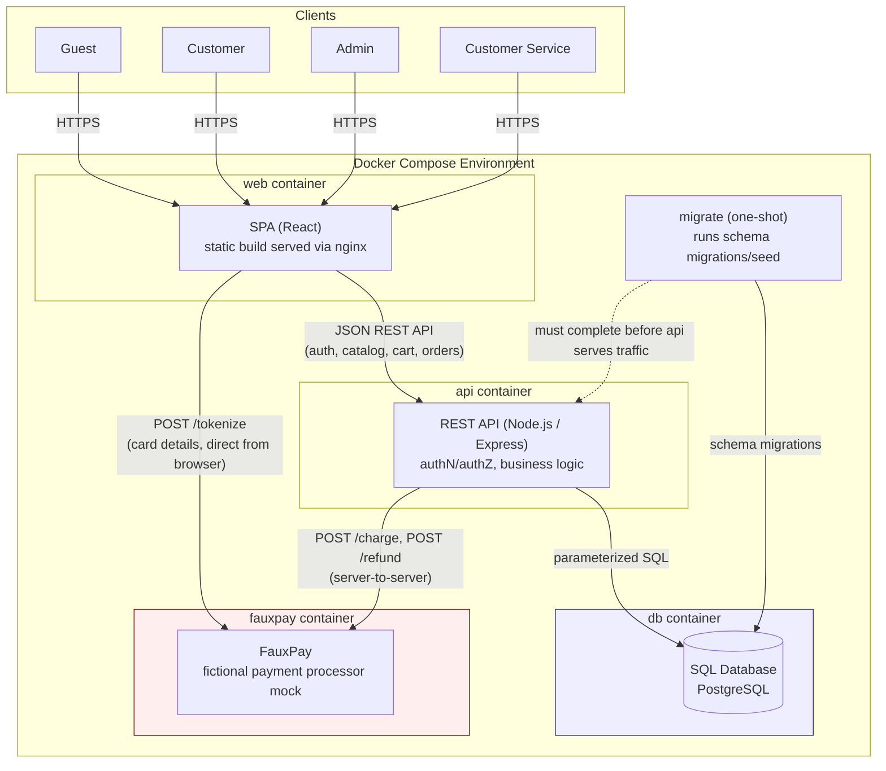
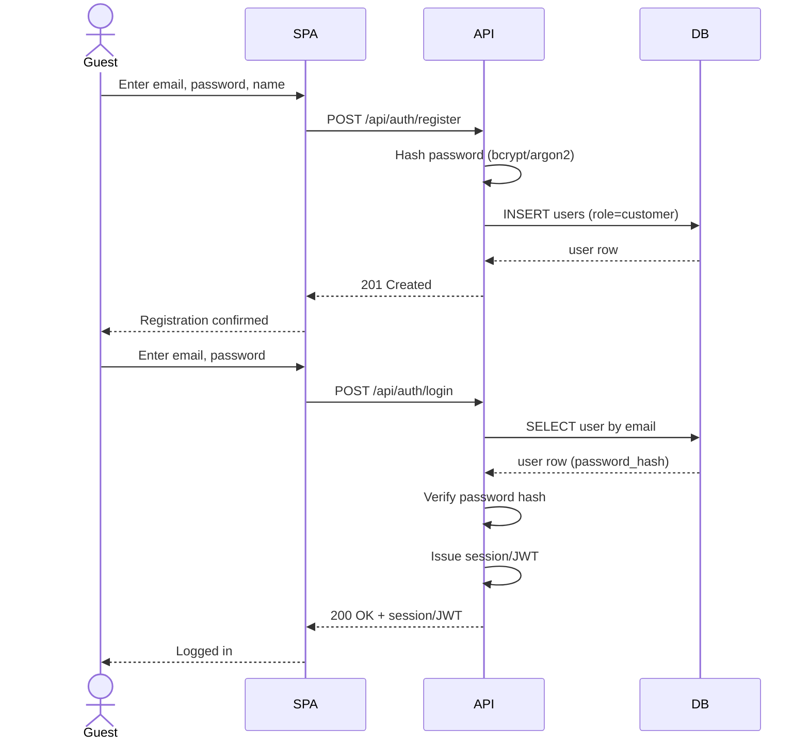
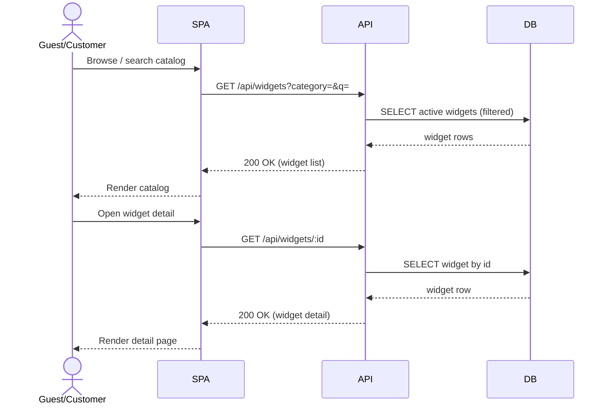
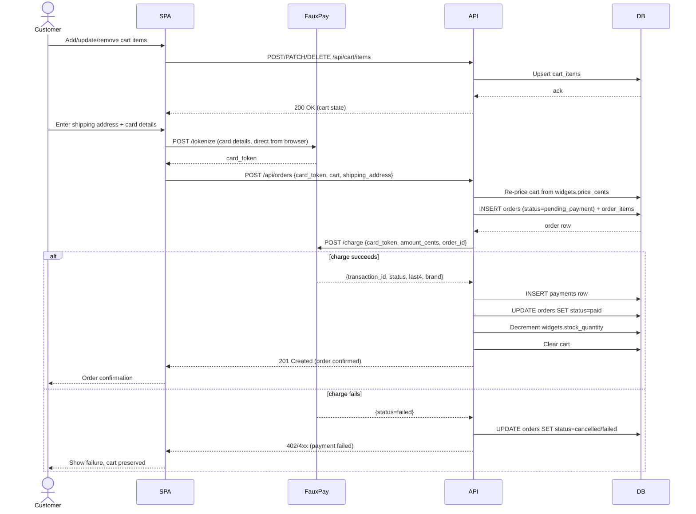
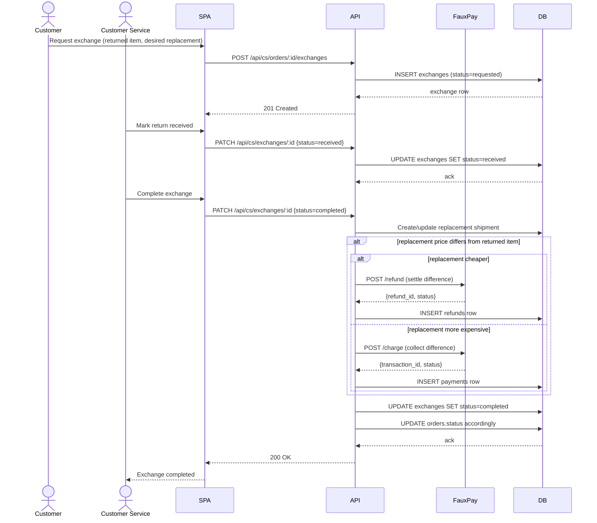

# Widget Shop — Design & Requirements

## 1. Overview

Widget Shop is a simple e-commerce sample application used for remediation-engineer training. It lets customers register, browse a catalog of widgets, add items to a cart, and check out with a credit card processed by a **fictional external payment processor**. Backend admins manage the catalog and pricing; a customer service role handles refunds and exchanges.

The app is a **Single Page Application (SPA)** frontend backed by a **REST API**, with a **SQL database** for persistence, and is deployed as a set of **Docker containers**.

This document intentionally leaves some implementation details open (they are filled in by the training scenarios), but defines enough structure — data model, API surface, roles, and flows — to build a working, realistic app that can later have vulnerabilities introduced/remediated.

---

## 2. Goals / Non-Goals

**Goals**
- Realistic, small-scope e-commerce app: auth, catalog, cart, checkout, order history, refunds/exchanges.
- Clear separation of roles: Customer, Admin, Customer Service.
- Simple enough to reason about end-to-end (schema, API, UI) for training purposes.
- Fictional payment processor integration point that mimics a real gateway (tokenization, charge, refund) without any real financial processing.

**Non-Goals**
- No real payment processing, PCI compliance, or storage of raw card data.
- No multi-tenancy, internationalization, tax calculation, or shipping-carrier integration.
- No high-availability / scaling concerns — this is a training sample, not production infrastructure.

---

## 3. Tech Stack

| Layer | Choice |
|---|---|
| Frontend | SPA (React or similar), calling the backend via JSON REST API |
| Backend | Node.js API server (e.g. Express) |
| Database | SQL (PostgreSQL or SQLite for local/dev) via an ORM/query builder |
| Auth | Session- or JWT-based auth, password hashing (bcrypt/argon2) |
| Payments | Fictional external processor, accessed over HTTPS via a thin client module |
| Deployment | Docker containers, orchestrated via Docker Compose |

---

## 3.1 Architecture Diagram

The following diagram reflects the containers described in §3 and §11: a browser-hosted SPA, an API server backed by a SQL database, and a fictional payment processor that the SPA talks to directly for tokenization and that the API talks to for charges/refunds.



Key architectural points from this document:
- The SPA never routes raw card data through the API (§6) — it goes browser → FauxPay directly, returning only an opaque `card_token`.
- The API is the sole client of the database and is the actual authorization boundary (§4) even though the SPA also hides unauthorized UI.
- `db` and `fauxpay` are not published to the host; only `api` (and, for tokenization, the browser) can reach `fauxpay`, and only `api` can reach `db` (§11.2).
- `migrate` must complete before `api` accepts traffic (§11.4, §11.7.5).

---

## 4. Roles & Permissions

| Role | Capabilities |
|---|---|
| **Guest** | Browse catalog, view widget details, register, log in |
| **Customer** | Everything Guest can do, plus: manage own profile/addresses, manage cart, checkout, view own order history, request a return/exchange |
| **Admin** | Manage catalog (create/edit/delete widgets, set prices, manage inventory/stock), manage widget categories, view all orders (read-only), manage user role assignments |
| **Customer Service (CS)** | View all orders and customers, issue refunds (full/partial) against an order/payment, process exchanges (accept returned item, ship replacement / adjust order), add internal notes to an order |

Role checks are enforced **server-side** on every API endpoint — the SPA hides UI it shouldn't show, but the API is the actual authorization boundary.

Admin and CS accounts are internal/staff accounts, not self-service registrations — they're provisioned by an existing Admin.

---

## 5. Core Domain / Data Model

### `users`
| Column | Type | Notes |
|---|---|---|
| id | PK | |
| email | unique, not null | login identifier |
| password_hash | not null | bcrypt/argon2 |
| full_name | | |
| role | enum: `customer`, `admin`, `customer_service` | default `customer` |
| created_at | timestamp | |

### `addresses`
| Column | Type | Notes |
|---|---|---|
| id | PK | |
| user_id | FK → users | |
| line1, line2, city, state, postal_code, country | | |
| is_default_shipping / is_default_billing | bool | |

### `widgets` (catalog items)
| Column | Type | Notes |
|---|---|---|
| id | PK | |
| sku | unique | |
| name | not null | |
| description | text | |
| price_cents | int, not null | current price, set by Admin |
| currency | default `USD` | |
| stock_quantity | int | |
| category_id | FK → categories, nullable | |
| image_url | | |
| is_active | bool | soft "delisting" instead of hard delete |
| created_by / updated_by | FK → users (admin) | |
| created_at / updated_at | timestamp | |

### `categories`
| Column | Type |
|---|---|
| id | PK |
| name | unique |

### `carts` / `cart_items`
- `carts`: one active cart per user (or session for guests, if guest carts are supported — otherwise require login before cart use).
- `cart_items`: `cart_id`, `widget_id`, `quantity`, `unit_price_cents` (snapshotted at add-time or re-priced at checkout — decide and document; recommend **re-pricing at checkout** from `widgets.price_cents` to avoid stale-price abuse).

### `orders`
| Column | Type | Notes |
|---|---|---|
| id | PK | |
| user_id | FK → users | |
| status | enum: `pending_payment`, `paid`, `refunded`, `partially_refunded`, `exchange_pending`, `exchanged`, `cancelled` | |
| subtotal_cents, total_cents | int | |
| shipping_address_id | FK | |
| payment_id | FK → payments | |
| created_at | timestamp | |

### `order_items`
| Column | Type |
|---|---|
| id | PK |
| order_id | FK → orders |
| widget_id | FK → widgets |
| quantity | int |
| unit_price_cents | int (price at time of purchase — immutable) |

### `payments`
| Column | Type | Notes |
|---|---|---|
| id | PK | |
| order_id | FK → orders | |
| processor_transaction_id | string | ID returned by fictional processor |
| processor_card_token | string | tokenized card reference (never raw PAN) |
| amount_cents | int | |
| status | enum: `authorized`, `captured`, `failed`, `refunded`, `partially_refunded` | |
| card_last4, card_brand | string | display only, from processor response |
| created_at | timestamp | |

### `refunds`
| Column | Type | Notes |
|---|---|---|
| id | PK | |
| order_id | FK → orders | |
| payment_id | FK → payments | |
| issued_by | FK → users | CS agent |
| amount_cents | int | |
| reason | text | |
| processor_refund_id | string | |
| created_at | timestamp | |

### `exchanges`
| Column | Type | Notes |
|---|---|---|
| id | PK | |
| order_id | FK → orders | original order |
| processed_by | FK → users | CS agent |
| returned_widget_id / returned_quantity | | item(s) sent back |
| replacement_widget_id / replacement_quantity | | item(s) shipped instead |
| status | enum: `requested`, `received`, `completed`, `rejected` | |
| notes | text | |
| created_at / updated_at | timestamp | |

**No table ever stores a full card number, CVV, or expiration date.** Only the fictional processor's opaque token and display metadata (last4, brand) are persisted, consistent with basic PCI-DSS scope reduction.

---

## 6. Fictional Payment Processor

A stand-in gateway, e.g. **"FauxPay"**, exposed to the backend as an internal client module (`services/fauxpayClient.js` or similar) that calls a mocked/fictional HTTPS API. It supports:

- `POST /tokenize` — accepts card details **directly from client-side SPA to FauxPay**, never through our backend, returning a `card_token`. (This mirrors real-world practice: our server never sees/touches raw PAN, minimizing our PCI scope.)
- `POST /charge` — backend calls with `{ card_token, amount_cents, currency, order_id }`, returns `{ transaction_id, status, last4, brand }`.
- `POST /refund` — backend calls with `{ transaction_id, amount_cents }`, returns `{ refund_id, status }`.

Since FauxPay is fictional, it can be implemented as a small mock service (or an in-process fake) that simulates realistic latency/success/failure — good enough for training scenarios that need to exercise both happy-path and failure/error handling.

---

## 7. Key Flows

### 7.1 Registration / Login
1. Guest submits email/password (+ name) → server hashes password, creates `users` row with role `customer`.
2. Login validates credentials, issues session/JWT.

### 7.2 Browse Catalog
- Public endpoint lists active widgets, filterable by category, searchable by name; widget detail view shows description/price/stock.

### 7.3 Cart & Checkout
1. Authenticated customer adds/updates/removes items in their cart.
2. On checkout: customer supplies shipping address and card details (entered directly into a FauxPay-hosted field/component in the SPA → tokenized client-side).
3. SPA sends `card_token` + cart + shipping address to backend `POST /orders`.
4. Backend re-prices cart from current `widgets.price_cents`, creates `orders` (status `pending_payment`) + `order_items`, calls FauxPay `/charge`.
5. On success: create `payments` row, set order status `paid`, decrement `stock_quantity`, clear cart.
6. On failure: order marked failed/cancelled, customer notified, cart preserved.

### 7.4 Admin — Catalog Management
- Admin creates/edits widgets (name, description, price, stock, category, image, active flag).
- Price changes only affect future carts/orders (existing `order_items.unit_price_cents` are immutable history).

### 7.5 Customer Service — Refunds
1. CS looks up an order (by order id, customer email, etc.).
2. CS issues a full or partial refund with a reason.
3. Backend calls FauxPay `/refund` for `amount_cents` against the original `processor_transaction_id`.
4. On success: create `refunds` row, update `payments.status` and `orders.status` (`refunded`/`partially_refunded`).

### 7.6 Customer Service — Exchanges
1. Customer (or CS on their behalf) requests an exchange on a delivered order, specifying returned item(s) and desired replacement.
2. CS marks the return `received` once the item is physically back.
3. CS completes the exchange: system creates/updates the replacement shipment; if replacement price differs from returned item, CS issues a partial refund or requests an additional payment (via a new FauxPay charge) to settle the difference.
4. Order/exchange status updated to `completed`.

---

## 7.7 Sequence Diagrams

### 7.7.1 Registration / Login (§7.1)



### 7.7.2 Browse Catalog (§7.2)



### 7.7.3 Cart & Checkout (§7.3)



### 7.7.4 Admin — Catalog Management (§7.4)

```mermaid
sequenceDiagram
    actor Admin
    participant SPA
    participant API
    participant DB

    Admin->>SPA: Create/edit widget (name, price, stock, category, active flag)
    SPA->>API: POST/PATCH /api/admin/widgets(/:id)
    API->>API: Check role == admin
    API->>DB: INSERT/UPDATE widgets (created_by/updated_by)
    DB-->>API: widget row
    API-->>SPA: 200/201 OK
    SPA-->>Admin: Catalog updated

    Note over API,DB: Existing order_items.unit_price_cents are immutable;\nprice changes only affect future carts/orders.
```

### 7.7.5 Customer Service — Refunds (§7.5)


### 7.7.6 Customer Service — Exchanges (§7.6)



---

## 8. API Surface (representative, not exhaustive)

```
Auth
  POST   /api/auth/register
  POST   /api/auth/login
  POST   /api/auth/logout

Catalog (public)
  GET    /api/widgets
  GET    /api/widgets/:id
  GET    /api/categories

Cart (customer)
  GET    /api/cart
  POST   /api/cart/items
  PATCH  /api/cart/items/:itemId
  DELETE /api/cart/items/:itemId

Checkout / Orders (customer)
  POST   /api/orders                 (checkout)
  GET    /api/orders                 (own order history)
  GET    /api/orders/:id

Admin (admin only)
  POST   /api/admin/widgets
  PATCH  /api/admin/widgets/:id
  DELETE /api/admin/widgets/:id
  POST   /api/admin/categories
  GET    /api/admin/orders           (read-only, all orders)
  PATCH  /api/admin/users/:id/role

Customer Service (customer_service only)
  GET    /api/cs/orders
  GET    /api/cs/orders/:id
  POST   /api/cs/orders/:id/refunds
  POST   /api/cs/orders/:id/exchanges
  PATCH  /api/cs/exchanges/:id
```

All non-public endpoints require authentication; role-restricted endpoints additionally check `role` server-side.

---

## 9. Functional Requirements Summary

1. Users can register and log in with email + password.
2. Any user (including guests) can browse and search the widget catalog.
3. Authenticated customers can add/update/remove items in a cart and check out.
4. Checkout requires a shipping address and a credit card, processed via the fictional external processor; the app never stores raw card numbers.
5. Successful checkout creates an order and decrements stock; failed checkout leaves the cart intact.
6. Admins can create, edit, and deactivate widgets, including setting price and stock.
7. Admins can view all orders (read-only) and manage staff role assignments.
8. Customer Service agents can view any order, issue full/partial refunds with a reason, and process exchanges (return + replacement, with price-difference settlement).
9. Every refund/exchange records who performed it and when (audit trail).
10. Role-based access control is enforced on the backend for every state-changing operation.

## 10. Non-Functional Requirements

- **Security**: password hashing, parameterized SQL (no string-concatenated queries), server-side authZ on every endpoint, no raw card data at rest, HTTPS assumed in deployment.
- **Data integrity**: order line items and prices are immutable once an order is placed; catalog price changes never retroactively alter past orders.
- **Auditability**: refunds and exchanges record the acting staff user, timestamp, and reason.
- **Testability**: fictional payment processor is mockable/deterministic for automated tests.

---

## 11. Deployment (Docker)

The application ships as a small set of containers, defined via a `docker-compose.yml` for local/training use (a production-style deployment would split these across separate hosts/services, but Compose is sufficient for this sample).

### 11.1 Containers

| Service | Image / Base | Notes |
|---|---|---|
| `web` | `node:XX-alpine` (multi-stage build) | Builds and serves the SPA (static build output served via nginx or a lightweight Node static server) |
| `api` | `node:XX-alpine` (multi-stage build) | Express API server |
| `db` | `postgres:XX-alpine` | SQL database, named volume for data persistence |
| `fauxpay` | `node:XX-alpine` | Fictional payment processor mock service, isolated on its own internal network segment |
| `migrate` (optional, one-shot) | same image as `api` | Runs DB migrations/seed on startup, then exits |

### 11.2 Networking

- A single Docker Compose network (or two: `frontend` and `backend`) so that:
  - `web` is reachable from the host (published port, e.g. `80`/`443`).
  - `api` is reachable from `web` and the host (for local dev), but in a hardened deployment only `web`/reverse-proxy would be published — `api` stays internal.
  - `db` and `fauxpay` are **not** published to the host; only `api` can reach them.
- A reverse proxy (nginx/Traefik) container can front `web` + `api` under one origin to avoid CORS and to terminate TLS.

### 11.3 Configuration & Secrets

- All service configuration (DB connection string, JWT/session secret, FauxPay base URL/API key, port numbers) is supplied via environment variables, not hardcoded.
- Local dev uses a `.env` file (excluded from version control via `.gitignore`); example values live in a committed `.env.example`.
- Database credentials and any signing secrets are treated as secrets — for Compose-based training use, env vars are acceptable; a real deployment would use Docker secrets or a secrets manager.

### 11.4 Data Persistence & Migrations

- `db` uses a named Docker volume so data survives container recreation (`docker compose down` without `-v`).
- Schema migrations run via the `migrate` one-shot service (or an entrypoint step on `api`) before `api` starts accepting traffic; Compose `depends_on` + a healthcheck on `db` gate startup order.

### 11.5 Images / Build

- Each Node service uses a **multi-stage Dockerfile**: a `build` stage with dev dependencies to compile/bundle, and a slim `runtime` stage (`node:XX-alpine`) that copies only production artifacts and `node_modules --omit=dev`.
- Containers run as a **non-root user** and do not run `npm install`/build steps at container start in production images.
- `.dockerignore` excludes `node_modules`, `.env`, and local build artifacts from the build context.

### 11.6 Representative `docker-compose.yml` shape

```yaml
services:
  web:
    build: ./web
    ports: ["8080:80"]
    depends_on: [api]

  api:
    build: ./api
    env_file: .env
    depends_on:
      db: { condition: service_healthy }
      fauxpay: { condition: service_started }
    expose: ["3000"]

  migrate:
    build: ./api
    command: ["npm", "run", "migrate"]
    env_file: .env
    depends_on:
      db: { condition: service_healthy }

  db:
    image: postgres:16-alpine
    environment:
      POSTGRES_DB: widgetshop
      POSTGRES_USER: widgetshop
      POSTGRES_PASSWORD_FILE: /run/secrets/db_password
    volumes: ["db_data:/var/lib/postgresql/data"]
    healthcheck:
      test: ["CMD-SHELL", "pg_isready -U widgetshop"]

  fauxpay:
    build: ./fauxpay
    expose: ["4000"]

volumes:
  db_data:
```

### 11.7 Deployment-Related Requirements

1. The app must run end-to-end via a single `docker compose up` with no manual host setup beyond providing a `.env`.
2. `db` and `fauxpay` must not be exposed on host-published ports.
3. No secret values are baked into images; all are injected at runtime via env vars/secrets.
4. Container images run as non-root and contain no dev-only tooling in the runtime stage.
5. `api` must not accept traffic until database migrations have completed successfully.
