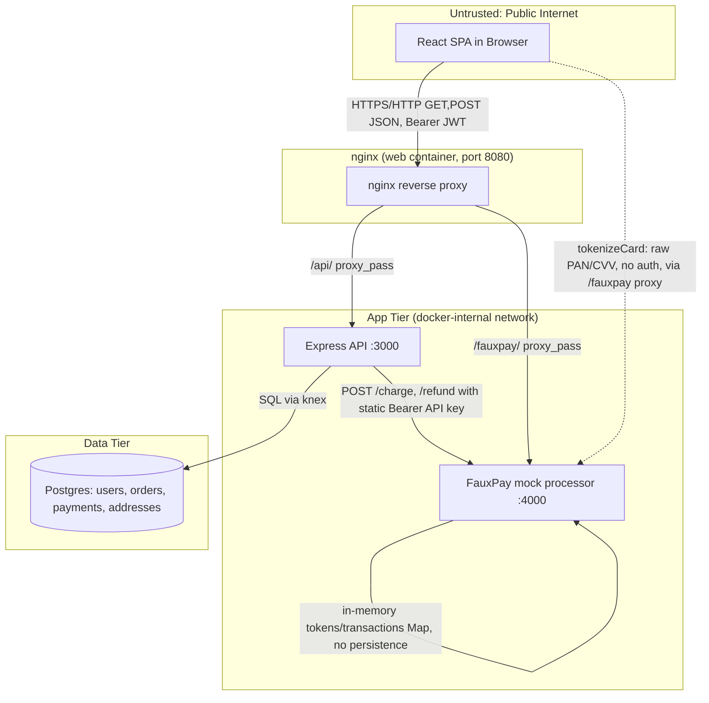
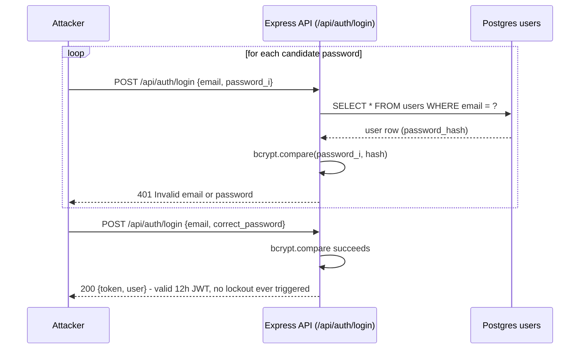
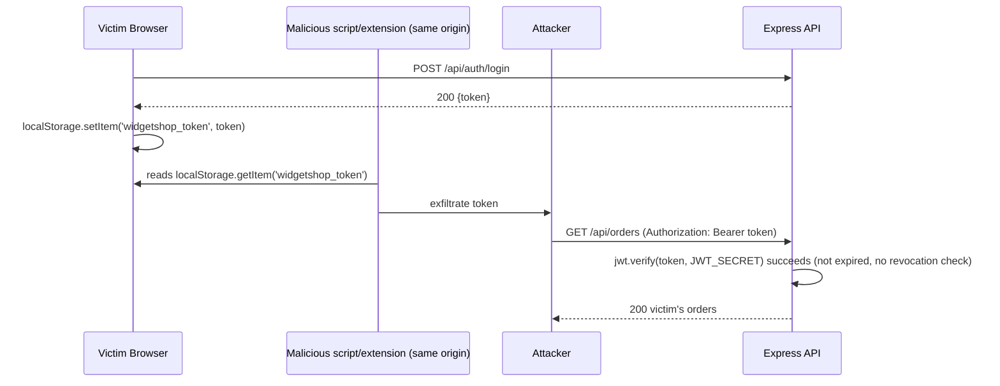
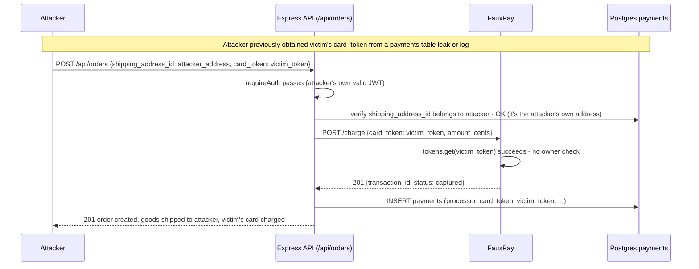
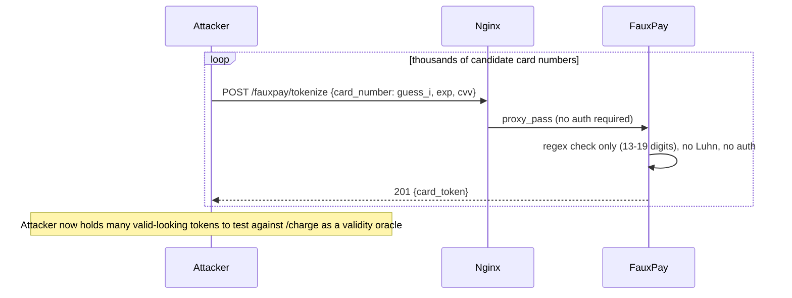

# Threat Model: Widget Shop (Node.js sample e-commerce app)

**Target analyzed:** `C:\Users\Eben_Weinman\OneDrive - EPAM\Projects\Remediation Engineer Training\Sample Application\Node JS`
**Source material:** code
**Generated:** 2026-08-19T20:17:35.164Z

## System Overview

A training e-commerce app: a React SPA (nginx-served) calls an Express REST API backed by Postgres, and separately calls a fictional payment processor "FauxPay" directly for card tokenization. The API charges/refunds through FauxPay server-to-server using a static API key. Roles are customer, customer_service, and admin, enforced via JWT bearer tokens issued at login/register. Trust boundaries: public internet -> nginx/API (auth boundary), browser -> FauxPay (payment tokenization, no user auth), API -> Postgres (data tier), API -> FauxPay (server-to-server, shared static secret).

## Architecture



## Data Flows

| ID | Name | Source → Destination | Trust Boundary Crossed |
|---|---|---|---|
| login | User login/registration | Browser → Express API / Postgres users table | public internet -> API/auth boundary |
| checkout | Checkout / payment | Browser → Express API -> FauxPay -> Postgres payments table | public internet -> API -> third-party processor |
| cart | Cart management | Browser → Express API / Postgres carts,cart_items | public internet -> API |
| cs-refund | Customer-service refunds/exchanges | Browser (CS agent) → Express API -> FauxPay -> Postgres orders/payments/refunds | authenticated customer -> elevated customer_service role boundary |
| admin | Admin catalog & role management | Browser (admin) → Express API / Postgres widgets,categories,users | authenticated user -> admin role boundary |
| tokenize | Card tokenization | Browser → FauxPay mock processor | public internet -> payment processor (bypasses API entirely) |

## Threats by Data Flow

### login — User login/registration

Browser posts email/password to /api/auth/login or /register; API checks bcrypt hash and issues a 12h JWT (sub, email, role) signed with JWT_SECRET; SPA stores it in localStorage and attaches it as Authorization: Bearer on every subsequent request.

#### [T-1] No rate limiting or lockout on login/register enables credential stuffing

**STRIDE:** Spoofing &nbsp;|&nbsp; **Severity:** HIGH

**Impact:** 3/5 &nbsp;|&nbsp; **Likelihood:** 4/5 &nbsp;|&nbsp; **Complexity:** 5/5

**Description**

The /api/auth/login and /api/auth/register endpoints perform no throttling, lockout, or CAPTCHA of any kind. app.js wires up the auth router with only express.json() and cors() as global middleware, and auth.js's login handler goes straight from body parsing to a bcrypt.compare with no attempt counter. api/package.json has no rate-limiting dependency (no express-rate-limit, no slowDown) anywhere in the API. This is exploitable specifically because bcrypt.compare is only reached after an unthrottled DB lookup by email, so an attacker can script large numbers of password guesses per account (or per email list) at line speed limited only by network/API throughput, with no lockout ever kicking in.

**Exploit scenario**

Attacker collects a leaked email/password combo list (or targets a specific known account like admin@widgetshop.test). They script repeated POST /api/auth/login requests with different passwords for the same email. Because nothing in app.js or auth.js tracks failed attempts per account or per IP, the attacker can send thousands of guesses per minute; each failed attempt returns a generic 401 with no delay, so they iterate until bcrypt.compare succeeds and they receive a valid 12h JWT for that account (potentially the seeded admin account with password ChangeMe123! from the README, if it was never rotated).

**Evidence**

- `api/src/routes/auth.js:37` — No attempt counter, delay, or lockout before or after bcrypt.compare

  ```
  router.post('/login', asyncHandler(async (req, res) => {
    const { email, password } = req.body || {};
    if (!email || !password) { ... }
    const user = await db('users').where({ email }).first();
    if (!user || !(await bcrypt.compare(password, user.password_hash))) {
      return res.status(401).json({ error: 'Invalid email or password' });
    }
  ```
- `api/src/app.js:12` — Only global middleware is cors()+express.json(); no rate-limit middleware anywhere in app.js

  ```
  app.use(cors());
  app.use(express.json());
  ...
  app.use('/api/auth', authRoutes);
  ```
- `api/package.json:12` — No express-rate-limit or similar package is a dependency

  ```
  "dependencies": { "bcryptjs": ..., "cors": ..., "dotenv": ..., "express": ..., "jsonwebtoken": ..., "knex": ..., "pg": ... }
  ```

**Exploit sequence**



**Remediation**

Add express-rate-limit (or an equivalent token-bucket) scoped per-IP and per-email on /api/auth/login and /api/auth/register (e.g. 5 attempts / 15 min with exponential backoff), and add a persistent failed-attempt counter on the users table that locks the account for a cooldown period after N consecutive failures, clearing on success. Pair this with generic error responses (already done) and structured audit logging of failed logins so lockouts are observable in monitoring.

---

#### [T-2] JWT stored in localStorage with no revocation mechanism — stolen token is fully valid for 12h

**STRIDE:** Information Disclosure &nbsp;|&nbsp; **Severity:** MEDIUM

**Impact:** 3/5 &nbsp;|&nbsp; **Likelihood:** 2/5 &nbsp;|&nbsp; **Complexity:** 3/5

**Description**

The SPA stores the raw JWT in `localStorage` (client.js) rather than in an HttpOnly cookie, making it readable by any JavaScript that runs in the page's origin (e.g. a supply-chain-compromised npm dependency, or a future XSS bug in any page that ever interpolates unescaped user content). Combined with this, the API's requireAuth (auth.js) only calls `jwt.verify(token, JWT_SECRET)` — there is no token blocklist/allowlist, no `jti`, and no session store consulted on each request. Once issued, a token is valid for the full 12h `expiresIn` window (auth.js line 33/48) regardless of logout, password change, or role change elsewhere (e.g. admin demoting a customer_service agent via PATCH /api/admin/users/:id/role does not invalidate that agent's already-issued token).

**Exploit scenario**

An attacker who obtains a user's token — via a malicious/compromised browser extension, a vulnerable third-party script sharing the origin, or physical/session access to the device — copies the value straight out of `localStorage.getItem('widgetshop_token')`. They then replay it as `Authorization: Bearer <token>` from any machine of their choosing for up to 12 hours. Nothing server-side distinguishes this replay from the legitimate user: requireAuth only checks the signature and expiry, and `logout()` in AuthContext.jsx merely clears client-side storage — it never calls the API to revoke anything, because no revocation endpoint or blocklist exists.

**Evidence**

- `web/src/api/client.js:6` — JWT kept in JS-readable storage, not an HttpOnly cookie

  ```
  function getToken() {
    return localStorage.getItem('widgetshop_token');
  }
  
  export function setToken(token) {
    if (token) localStorage.setItem('widgetshop_token', token);
    else localStorage.removeItem('widgetshop_token');
  }
  ```
- `api/src/middleware/auth.js:5` — Only signature/expiry checked; no jti/blocklist/session lookup

  ```
  function requireAuth(req, res, next) {
    const header = req.headers.authorization || '';
    const token = header.startsWith('Bearer ') ? header.slice(7) : null;
    if (!token) return res.status(401).json(...);
    try {
      req.user = jwt.verify(token, JWT_SECRET);
      next();
    } catch (err) { ... }
  }
  ```
- `api/src/routes/auth.js:33` — 12h validity with no revocation path

  ```
  const token = jwt.sign({ sub: user.id, email: user.email, role: user.role }, JWT_SECRET, { expiresIn: '12h' });
  ```
- `web/src/AuthContext.jsx:30` — Logout only clears client state; never revokes server-side

  ```
  function logout() {
    setToken(null);
    setUser(null);
  }
  ```

**Exploit sequence**



**Remediation**

Move to a Backend-for-Frontend pattern: have the API set the JWT (or an opaque session id) in an HttpOnly, Secure, SameSite=Strict cookie instead of returning it to JS, so the browser never has script-readable access to the credential. Additionally, add a `jti` claim per token and a server-side revocation store (e.g. a Redis set of revoked jti's or a `token_version` column on `users` checked in requireAuth), and bump/check that version on logout, password change, and role change so previously issued tokens stop working immediately instead of remaining valid for up to 12h.

---

### checkout — Checkout / payment

Authenticated user tokenizes a card directly against FauxPay (no auth), then POSTs shipping_address_id + card_token to /api/orders; API re-prices from catalog, creates order+order_items in a transaction, then calls FauxPay /charge server-to-server with a static API key, and persists the processor_card_token permanently in the payments table.

#### [T-3] Payment card_token is a bearer credential not bound to the tokenizing user, and is stored permanently in plaintext

**STRIDE:** Tampering &nbsp;|&nbsp; **Severity:** HIGH

**Impact:** 4/5 &nbsp;|&nbsp; **Likelihood:** 2/5 &nbsp;|&nbsp; **Complexity:** 3/5

**Description**

FauxPay's `/tokenize` issues a `card_token` that is a pure bearer value — `tokens.set(token, { last4, brand })` in fauxpay/src/server.js has no concept of which user/session created it. The API's checkout handler (orders.js) accepts `card_token` straight from the client body and passes it to `fauxpay.charge` with zero check that the token belongs to the requesting user (there is no `user_id` column anywhere near FauxPay's token map, and orders.js line 12-17 never cross-references it). The resulting `processor_card_token` is then written verbatim into the `payments` table in plaintext (migration `20260101000007_create_payments.js` line 6: `table.string('processor_card_token')`) with no encryption-at-rest, hashing, or TTL, and is kept indefinitely after the purchase completes.

**Exploit scenario**

Because a card_token is just a random-looking bearer string honored by FauxPay for any request that carries it, if an attacker ever observes one belonging to another user — e.g. via server logs, a browser history/proxy tool, a referrer leak, or (most directly) a database read from the `payments` table where it is stored forever in plaintext — they can register their own Widget Shop account, add items to their own cart, and POST /api/orders with `shipping_address_id` pointing at an address *they* control and `card_token` set to the stolen value. orders.js never validates that the token 'belongs' to req.user; it simply forwards it to fauxpay.charge, which charges the original cardholder while shipping goods to the attacker.

**Evidence**

- `fauxpay/src/server.js:29` — Token map has no user/session binding

  ```
  app.post('/tokenize', (req, res) => {
    const { card_number, exp_month, exp_year, cvv } = req.body || {};
    ...
    const token = `tok_${crypto.randomBytes(16).toString('hex')}`;
    tokens.set(token, { last4: card_number.slice(-4), brand: detectBrand(card_number) });
    res.status(201).json({ card_token: token });
  });
  ```
- `api/src/routes/orders.js:11` — card_token taken from client body and used with no ownership check

  ```
  router.post('/', asyncHandler(async (req, res) => {
    const { shipping_address_id, card_token } = req.body || {};
    ...
    chargeResult = await fauxpay.charge({ cardToken: card_token, amountCents: totalCents, orderId: order.id });
  ```
- `api/src/db/migrations/20260101000007_create_payments.js:6` — Stored in plaintext, indefinitely, no encryption/TTL

  ```
  table.string('processor_card_token');
  ```

**Exploit sequence**



**Remediation**

Bind each card_token to the session/user that created it (FauxPay's `/tokenize` should accept and store the caller's user id or a short-lived nonce tied to the checkout session, and `/charge` should require that binding to match); alternatively, treat tokens as single-use and expire them immediately after a successful charge so a leaked historical token from the payments table can never be replayed. Additionally, stop persisting `processor_card_token` after the charge completes — store only the processor's `processor_transaction_id` and masked `card_last4`/`card_brand`, which is all that's needed for support/refund flows (refunds already use `processor_transaction_id`, not the card token).

---

#### [T-5] TOCTOU race in stock check-then-decrement allows overselling via concurrent checkouts

**STRIDE:** Tampering &nbsp;|&nbsp; **Severity:** LOW

**Impact:** 2/5 &nbsp;|&nbsp; **Likelihood:** 2/5 &nbsp;|&nbsp; **Complexity:** 3/5

**Description**

orders.js reads `widget.stock_quantity` and compares it to the requested quantity *before* opening the transaction (lines 30-39), then, inside the transaction, unconditionally runs `decrement('stock_quantity', li.quantity)` (line 62) with no `WHERE stock_quantity >= quantity` guard and no row-locking (`SELECT ... FOR UPDATE`) tying the check to the decrement. Postgres's default READ COMMITTED isolation does not serialize these two statements against a concurrent request for the same widget, so two checkout requests that each individually see sufficient stock can both proceed to decrement, driving `stock_quantity` negative and both orders getting charged by FauxPay for units that don't exist.

**Exploit scenario**

A widget has `stock_quantity = 1`. Two customers (or one attacker with two browser tabs / a script firing parallel requests) both add it to their carts and hit "checkout" at nearly the same instant. Both requests execute the pre-transaction `widget.stock_quantity < item.quantity` check (1 < 1 is false) before either has committed a decrement, so both pass. Both transactions then run `decrement('stock_quantity', 1)`, leaving `stock_quantity = -1`, and both orders proceed to a successful FauxPay charge — the shop has now sold one unit of inventory twice and charged two cards for stock it doesn't have.

**Evidence**

- `api/src/routes/orders.js:30` — Stock check performed outside the transaction, on a snapshot read

  ```
  const widgets = await db('widgets').whereIn('id', widgetIds).andWhere({ is_active: true });
  ...
  for (const item of cartItems) {
    const widget = widgetsById.get(item.widget_id);
    if (!widget) return res.status(400)...
    if (widget.stock_quantity < item.quantity) {
      return res.status(400).json({ error: `Insufficient stock for ${widget.name}` });
    }
  }
  ```
- `api/src/routes/orders.js:61` — Decrement has no WHERE stock_quantity >= quantity guard and no row lock, so it isn't atomic with the earlier check

  ```
  for (const li of lineItems) {
    await trx('widgets').where({ id: li.widget_id }).decrement('stock_quantity', li.quantity);
  }
  ```

**Exploit sequence**

```mermaid
sequenceDiagram
    participant U1 as Customer A
    participant U2 as Customer B
    participant API as Express API
    participant DB as Postgres widgets

    par Customer A checkout
        U1->>API: POST /api/orders
        API->>DB: SELECT stock_quantity FROM widgets WHERE id=X (=1)
        API->>API: 1 < 1 is false, check passes
    and Customer B checkout
        U2->>API: POST /api/orders
        API->>DB: SELECT stock_quantity FROM widgets WHERE id=X (=1)
        API->>API: 1 < 1 is false, check passes
    end
    API->>DB: BEGIN; UPDATE widgets SET stock_quantity = stock_quantity - 1 (Customer A)
    API->>DB: BEGIN; UPDATE widgets SET stock_quantity = stock_quantity - 1 (Customer B)
    DB-->>API: stock_quantity now -1
    API-->>U1: 201 order paid
    API-->>U2: 201 order paid
```

**Remediation**

Make the decrement itself the check: replace the unconditional `decrement` with a conditional update such as `trx('widgets').where({ id: li.widget_id }).andWhere('stock_quantity', '>=', li.quantity).decrement('stock_quantity', li.quantity)` and verify the affected row count equals 1; if not, roll back the transaction and return 'insufficient stock' at commit time instead of relying on the earlier snapshot read. This makes stock depletion atomic per-row under Postgres's row-level locking regardless of concurrency.

---

### tokenize — Card tokenization

Browser posts raw card_number/exp/cvv directly to FauxPay's /tokenize endpoint (proxied by nginx at /fauxpay/), which has no authentication and only checks digit-count format, returning a bearer-style card_token.

#### [T-4] Unauthenticated, unthrottled /tokenize and /charge with no card-number validation enables card testing (carding)

**STRIDE:** Denial of Service &nbsp;|&nbsp; **Severity:** MEDIUM

**Impact:** 3/5 &nbsp;|&nbsp; **Likelihood:** 3/5 &nbsp;|&nbsp; **Complexity:** 5/5

**Description**

FauxPay's `/tokenize` endpoint (fauxpay/src/server.js line 29) requires no authentication (unlike `/charge` and `/refund`, which require the static API key) and is reachable straight from the public internet through nginx's `/fauxpay/` proxy (nginx.conf line 12, `proxy_pass http://fauxpay:4000/`) with no path restriction. It accepts any 13-19 digit string as `card_number` with no Luhn check and no per-IP/per-token rate limit anywhere in the service. This is exactly the mechanical shape of a card-testing (carding) endpoint: an attacker can script large volumes of tokenize→charge attempts to probe which digit sequences the processor accepts, entirely unthrottled.

**Exploit scenario**

An attacker scripts a loop that POSTs sequential/random 16-digit numbers to `https://<host>/fauxpay/tokenize`. Since there's no auth and no Luhn validation, every syntactically-valid number returns 201 with a usable `card_token`. The attacker then chains that token into a low-value order (`/api/orders` after creating a throwaway Widget Shop account) to see whether `/charge` succeeds, effectively using the storefront's checkout as a card-validity oracle at whatever rate their script can sustain — nothing in FauxPay or the API throttles either endpoint.

**Evidence**

- `fauxpay/src/server.js:29` — No auth middleware applied to this route (unlike /charge, /refund which use requireApiKey), no Luhn check

  ```
  app.post('/tokenize', (req, res) => {
    const { card_number, exp_month, exp_year, cvv } = req.body || {};
    if (!card_number || !exp_month || !exp_year || !cvv) { ... }
    if (!/^\d{13,19}$/.test(card_number)) { ... }
    const token = `tok_${crypto.randomBytes(16).toString('hex')}`;
  ```
- `web/nginx.conf:12` — Publicly reachable via the host-exposed nginx port 8080 with no path allowlist/rate limit

  ```
  location /fauxpay/ {
      proxy_pass http://fauxpay:4000/;
      proxy_set_header Host $host;
  }
  ```

**Exploit sequence**



**Remediation**

Require the tokenization request to be tied to an authenticated, rate-limited checkout session (e.g. a short-lived, single-use nonce issued by the API only after `requireAuth`, that `/tokenize` must present), and add per-IP rate limiting in front of both `/tokenize` and `/charge` (e.g. express-rate-limit in FauxPay, or a WAF rule at the nginx layer) so bulk enumeration is throttled the same way a real processor would apply velocity checks.

---

## Data Flows With No Findings

The following data flows were identified but no exploitable threat was substantiated against them in this pass:

- **cart — Cart management**: Authenticated user adds/updates/removes cart items scoped to their own cart via req.user.sub.
- **cs-refund — Customer-service refunds/exchanges**: Users with customer_service role look up any customer's orders by email/id and issue refunds (via FauxPay /refund) or exchanges against any order in the system.
- **admin — Admin catalog & role management**: Admin-role users create/update/deactivate widgets and categories, view all orders, and change any user's role (customer/admin/customer_service) via PATCH /api/admin/users/:id/role.

## Summary

Total findings: 5
- high: 2
- medium: 2
- low: 1